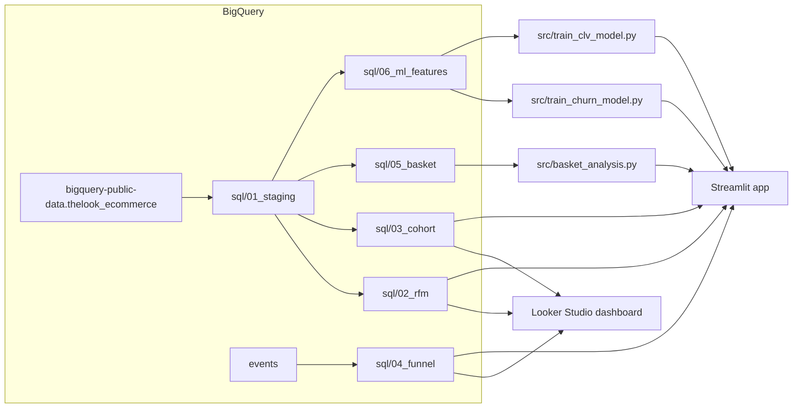

# TheLook E-commerce Analytics

An end-to-end analytics project on Google BigQuery's public
[`thelook_ecommerce`](https://console.cloud.google.com/marketplace/product/bigquery-public-data/thelook-ecommerce)
dataset: SQL data marts, RFM segmentation, cohort retention, funnel analysis,
market-basket rules, and churn/CLV prediction models, surfaced through a
Looker Studio dashboard and a Streamlit app.

This extends an earlier, simpler RFM dashboard (business KPIs only) with a
proper mart layer, time-safe ML labels, and a second, code-facing
presentation layer.

## Architecture



## What's in each layer

| Layer | Location | Purpose |
|---|---|---|
| Staging | `sql/01_staging` | One row per order line, joined to product/user |
| RFM segmentation | `sql/02_rfm` | Recency/Frequency/Monetary scoring + rule-based segments |
| Cohort retention | `sql/03_cohort` | Monthly acquisition cohorts, retention curves |
| Purchase funnel | `sql/04_funnel` | Clickstream funnel: view → cart → purchase, by channel |
| Basket analysis | `sql/05_basket` | Category co-purchase pairs, feeds Apriori rule mining |
| ML features | `sql/06_ml_features` | Time-split churn label + next-90-day spend (CLV) target |
| Churn model | `src/train_churn_model.py` | GradientBoostingClassifier, ROC AUC reported |
| CLV model | `src/train_clv_model.py` | GradientBoostingRegressor + BG/NBD + Gamma-Gamma baseline |
| Basket rules | `src/basket_analysis.py` | mlxtend Apriori → support/confidence/lift |
| App | `app/streamlit_app.py` | Interactive cohort heatmap, funnel, basket rules, live predictions |

The churn/CLV labels are built with a strict time-based split (features from
before a 90-day-prior cutoff, labels from after it) so the model is
evaluated the way it would actually be used — predicting the future from the
past, not from data that leaks the answer.

## Setup

```bash
gcloud auth application-default login
cp .env.example .env   # fill in your own GCP_PROJECT_ID (used as the query/billing project)
python3 -m venv .venv && source .venv/bin/activate
pip install -r requirements.txt
```

## Run

```bash
# 1. Build all BigQuery marts (staging -> RFM -> cohort -> funnel -> basket -> ML features)
python -m src.run_sql

# 2. Train models
python -m src.train_churn_model
python -m src.train_clv_model
python -m src.basket_analysis

# 3. Explore
streamlit run app/streamlit_app.py
```

The Looker Studio dashboard is built on top of the same `thelook_marts.*`
tables: [dashboard link — add after publishing].

## Key findings

- **71,996 users, $9.2M monetary in the feature window**, avg order frequency
  1.48, avg return rate 11.9%. Segments skew low-engagement: 47.9% "一般用户"
  (general), 18.6% sleeping/low-value, 13.6% new/potential, 13% high-value
  active, 6.8% high-value at churn risk.
- **Most customers never come back.** In the 90-day-ahead churn label, 92.7%
  of users placed zero orders — because the large majority of users in this
  dataset are one-time buyers (avg frequency 1.48). This makes churn
  prediction inherently hard: the GradientBoosting churn classifier reaches
  ROC AUC 0.687 / balanced accuracy 0.63 after correcting for class
  imbalance (`class_weight="balanced"`), and the CLV regressor only explains
  R² = 0.02 of next-90-day spend variance. The BG/NBD + Gamma-Gamma
  probabilistic model — which assumes a repeat-purchase process — assigns
  $0 lifetime value to 68.9% of users, for the same reason. **The honest
  takeaway is a business one, not a modeling one**: acquisition and
  first-order conversion matter far more here than retention modeling: with
  this little repeat-purchase signal, no model architecture will predict
  churn/CLV much better without additional behavioral data (e.g. email
  engagement, browsing recency) beyond what's in `thelook_ecommerce`.
- **Funnel**: of 681,198 sessions, 100% include a product-view event (a
  quirk of this synthetic dataset — every session views a product), 63.2%
  add to cart, and 26.6% convert to purchase overall (42.1% cart→purchase).
  The real drop-off point is add-to-cart, not product discovery.
- **Basket analysis** (30 rules, min support 0.2%): the strongest
  cross-category affinities are Dresses↔Maternity (lift 1.38),
  Skirts↔Intimates (lift 1.34), and Underwear↔Suits & Sport Coats (lift
  1.29) — all modest lifts, consistent with 71% of orders touching only one
  category.

## Screenshots

`docs/screenshots/` — add after running the Streamlit app and exporting the
Looker Studio dashboard.

## Tech stack

BigQuery (SQL) · Python (pandas, scikit-learn, lifetimes, mlxtend) ·
Streamlit · Plotly · Looker Studio

## License

MIT
